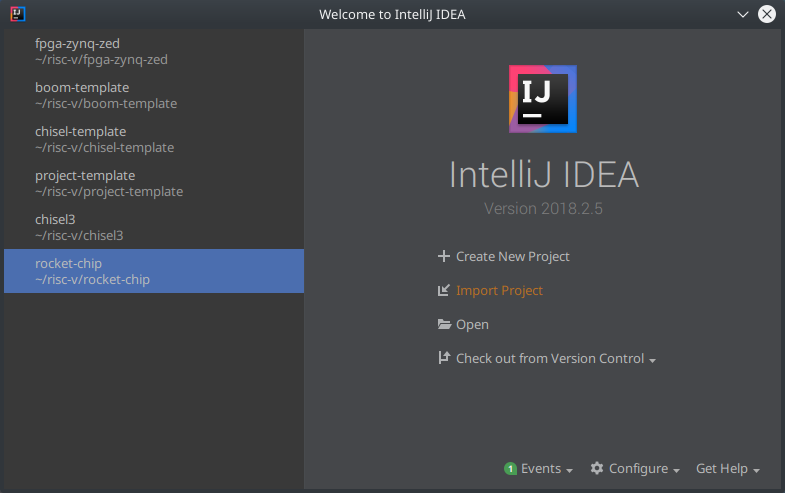
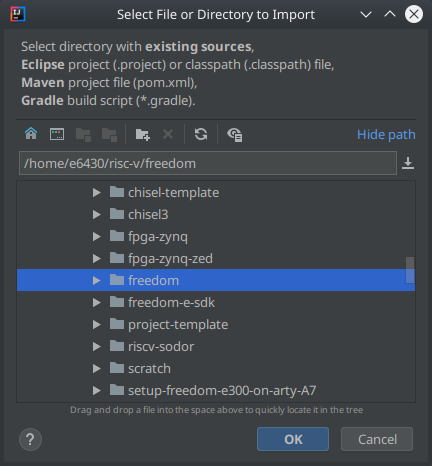
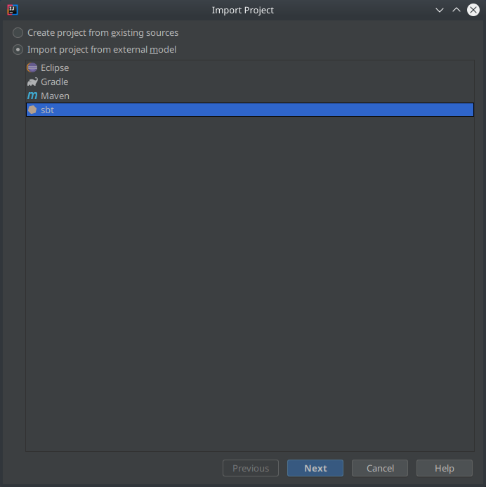
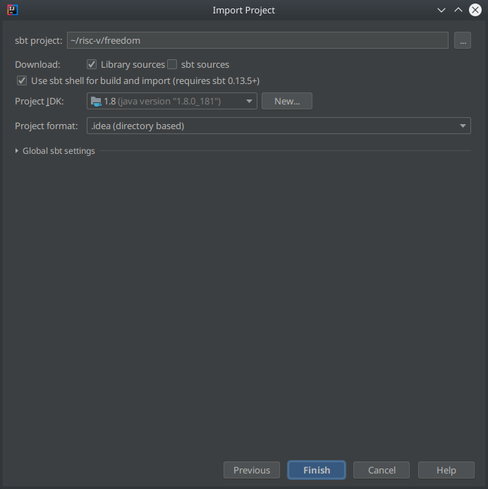
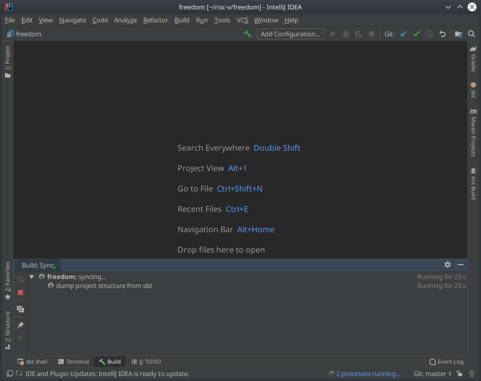
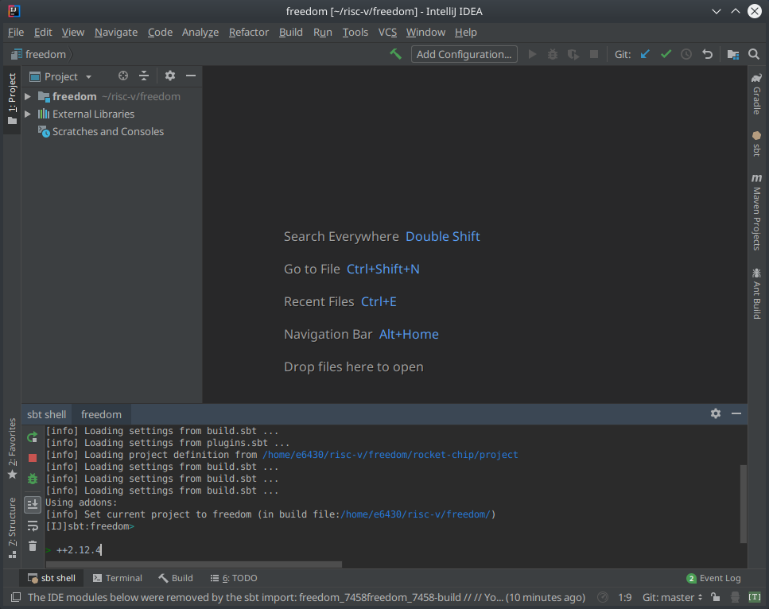

Freedom
=======

This repository contains the RTL created by SiFive for its Freedom E300 and U500
platforms. The Freedom E310 Arty FPGA Dev Kit implements the Freedom E300
Platform and is designed to be mapped onto an [Arty FPGA Evaluation
Kit](https://www.xilinx.com/products/boards-and-kits/arty.html). The Freedom
U500 VC707 FPGA Dev Kit implements the Freedom U500 Platform and is designed to
be mapped onto a [VC707 FPGA Evaluation
Kit](https://www.xilinx.com/products/boards-and-kits/ek-v7-vc707-g.html).
Both systems boot autonomously and can be controlled via an external debugger.

Run the following commands to clone the repository and get started:

```sh
$ git clone https://github.com/sifive/freedom.git
$ cd freedom

#Run this command to update subrepositories used by freedom
$ git submodule update --init --recursive
```

Next, read the section corresponding to the kit you are interested in for
instructions on how to use this repo.

Software Requirement
--------------------

To compile the bootloaders for both Freedom E300 Arty and U500 VC707
FPGA dev kits, the RISC-V software toolchain must be installed locally and
set the $(RISCV) environment variable to point to the location of where the
RISC-V toolchains are installed. You can build the toolchain from scratch
or download the tools here: https://www.sifive.com/products/tools/


Freedom E300 Arty FPGA Dev Kit
------------------------------

The Freedom E300 Arty FPGA Dev Kit implements a Freedom E300 chip.

### How to build

The Makefile corresponding to the Freedom E300 Arty FPGA Dev Kit is
`Makefile.e300artydevkit` and it consists of two main targets:

- `verilog`: to compile the Chisel source files and generate the Verilog files.
- `mcs`: to create a Configuration Memory File (.mcs) that can be programmed
onto an Arty FPGA board.

To execute these targets, you can run the following commands:

```sh
$ make -f Makefile.e300artydevkit verilog
$ make -f Makefile.e300artydevkit mcs
```

Note: This flow requires Vivado 2017.1. Old versions are known to fail.

These will place the files under `builds/e300artydevkit/obj`.

Note that in order to run the `mcs` target, you need to have the `vivado`
executable on your `PATH`.

### Bootrom

The default bootrom consists of a program that immediately jumps to address
0x20400000, which is 0x00400000 bytes into the SPI flash memory on the Arty
board.

### Using the generated MCS Image

For instructions for getting the generated image onto an FPGA and programming it with software using the [Freedom E SDK](https://github.com/sifive/freedom-e-sdk), please see the [Freedom E310 Arty FPGA Dev Kit Getting Started Guide](https://www.sifive.com/documentation/freedom-soc/freedom-e300-arty-fpga-dev-kit-getting-started-guide/).

Freedom U500 VC707 FPGA Dev Kit
-------------------------------

The Freedom U500 VC707 FPGA Dev Kit implements the Freedom U500 platform.

### How to build

The Makefile corresponding to the Freedom U500 VC707 FPGA Dev Kit is
`Makefile.vc707-u500devkit` and it consists of two main targets:

- `verilog`: to compile the Chisel source files and generate the Verilog files.
- `mcs`: to create a Configuration Memory File (.mcs) that can be programmed
onto an VC707 FPGA board.

To execute these targets, you can run the following commands:

```sh
$ make -f Makefile.vc707-u500devkit verilog
$ make -f Makefile.vc707-u500devkit mcs
```

Note: This flow requires Vivado 2016.4. Newer versions are known to fail.

These will place the files under `builds/vc707-u500devkit/obj`.

Note that in order to run the `mcs` target, you need to have the `vivado`
executable on your `PATH`.

### Bootrom

The default bootrom consists of a bootloader that loads a program off the SD
card slot on the VC707 board.

IntelliJ Setup
-------------------------------
This subsection will help you to setup IntelliJ.  
The steps will describe what options you have to choose to get a hassle-free build.  
If not otherwise stated, simply press next or hit enter in the corresponding dialog to get to the next step.  

1. Select "Import project"  


2. Locate the root folder of the freedom repository  


3. Select sbt as a external model to import the project from  


4. Check the option to use the sbt shell for build and import  


5. The IDE will open and try to import the freedom package. This will fail because IntelliJ builds all submodules with the version of the individual build.sbt file. We need to change that. Continue with the next step  


6. Switch to the sbt shell and enter ++2.12.4  


Done. IntelliJ now should be able to build the repository and show you code highlighting.  
You might need to hit reimport in the build view which can be seen in step 5.
